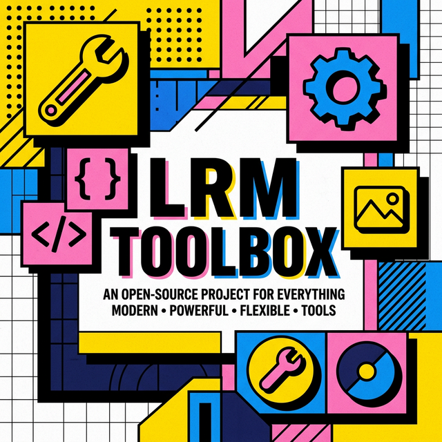

<p align="center">
  
</p>

# 🛠️ LRM工具箱 (LRM Toolbox)

<p align="center">
  <a href="https://github.com/van104/LRM-Toolbox/blob/main/LICENSE">
    
  </a>
  
  
  
  <a href="https://www.lrm123.site/">
    
  </a>
</p>

**LRM工具箱** 是一个功能强大、设计超前的在线开源工具箱。它采用了 **新粗野主义 (Neobrutalism)** 设计风格，旨在为开发者、设计师及日常办公人员提供极致的效率体验。

> **🌐 访问在线体验：[https://www.lrm123.site/](https://www.lrm123.site/)**

---

## ✨ 核心特性

- 🎨 **视觉冲击**：基于核心色彩体系的新粗野主义 UI，拒绝平庸。
- 📦 **海量集成**：内置 255+ 款实用工具，涵盖 10 大分类，持续更新。
- ⚡ **极致性能**：基于 Vite 7 + Vue 3 极速构建，资源按需加载。
- 🛡️ **隐私至上**：99% 的工具纯前端运行，数据永不离机。
- 📱 **多端适配**：响应式布局，完美适配手机、平板及电脑。
- 🌙 **深色模式**：全局原生深色模式支持，守护您的视力。

---

## 🛠️ 工具全景图 (Tools Panorama)

| 分类              | 包含工具 (部分展示)                                       |
| :---------------- | :-------------------------------------------------------- |
| **👨‍💻 开发者工具** | JSON 格式化、Base64 编解码、正则表达式、JWT 解码、Crontab |
| **🖼️ 图像处理**   | 图片压缩、格式转换、尺寸调整、水印、背景移除              |
| **📝 文本工具**   | 差异对比、Markdown 编辑器、字数统计、清洗、加密           |
| **📄 PDF 处理**   | 转图片、图片换转、PDF 拆分/合并、水印、加密               |
| **🏠 生活助手**   | 单位换算、日期计算、房贷/个税计算、垃圾分类               |
| **💰 金融理财**   | 汇率转换、养老/复利/盈亏计算                              |
| **🎓 教育学习**   | 拼音查询、公式编辑、成语词典、字帖生成                    |
| **🎮 趣味游戏**   | 2048、五子棋、井字棋、扫雷、像素画绘制、ASCII 艺术        |
| **🏥 健康工具**   | BMI 计算、卡路里计算、番茄钟、计时器                      |

---

## 🚀 快速开始 (Quick Start)

### 环境要求

- **Node.js**: >= 18.0.0
- **npm**: >= 8.0.0

### 安装与运行

```bash
# 1. 克隆项目
git clone https://github.com/van104/LRM-Toolbox.git

# 2. 进入目录
cd LRM-Toolbox

# 3. 安装依赖
npm install

# 4. 启动开发服务器
npm run dev
```

---

## 🌐 部署指南

### 前端部署 (Nginx 配置)

构建生成静态文件：

```bash
npm run build
```

Nginx 伪静态配置 (SPA 路由适配)：

```nginx
location / {
  try_files $uri $uri/ /index.html;
}
```

### 反馈系统后端

反馈后端位于 `/server` 目录，由 Node.js + SQLite 驱动：

1. 将 `server` 目录上传至服务器。
2. 配置 `.env` (含 `ADMIN_PASSWORD` 和 `ALLOWED_ORIGINS`)。
3. 执行 `npm install` 后使用 `pm2` 或 `node` 启动。

---

## 📂 项目结构 (Structure)

```text
LRM-Toolbox/
├── public/              # 静态资源 (Logo, Banner, PWA 图标)
├── server/              # 反馈系统后端 (Node.js + SQLite)
│   ├── data/            # 数据库存储
│   ├── server.js        # 后端入口
│   └── .env             # 后端环境配置
├── src/
│   ├── api/             # 接口请求封装
│   ├── components/      # UI 组件
│   │   ├── common/      # 通用原子组件
│   │   ├── layout/      # 全局布局 (Header, Footer, Menu)
│   │   ├── icons/       # 系统图标 (SVG)
│   │   └── tools/       # 核心工具业务逻辑 (按分类存放)
│   ├── data/            # 工具清单及本地策略
│   ├── router/          # 路由映射
│   ├── stores/          # 全局状态 (User, App Config)
│   ├── styles/          # 粗野主义设计系统 (CSS)
│   ├── utils/           # 辅助函数 (转换、加密、校验等)
│   └── views/           # 页面级视图
├── index.html           # 页面入口
├── package.json         # 项目依赖与脚本
└── vite.config.ts       # Vite 构建配置
```

---

## 🤝 贡献与反馈

- **提交 PR**：如果您有想添加的工具，欢迎 fork 并提交 PR。
- **报告 Bug**：请通过 [GitHub Issues](https://github.com/van104/LRM-Toolbox/issues) 进行反馈。

---

## 📄 开源许可证与版权声明

本项目采用 **AGPL-3.0 (GNU Affero General Public License v3.0)** 开源。

### ⚠️ 严正声明

1. **拒绝套壳**：禁止简单“换皮”后用于任何盈利目的。
2. **强制开源**：基于本项目二次开发并提供网络服务的，**必须**公开修改后的源码。
3. **保留版权**：任何衍生版本必须显著保留原作者版权声明及本项目链接。

> **Copyright © 2026 LRM (van104)**. 保留所有法律追究权利。

---

<p align="center">
  以代码驱动效率，以设计定义美感。🚀
</p>
